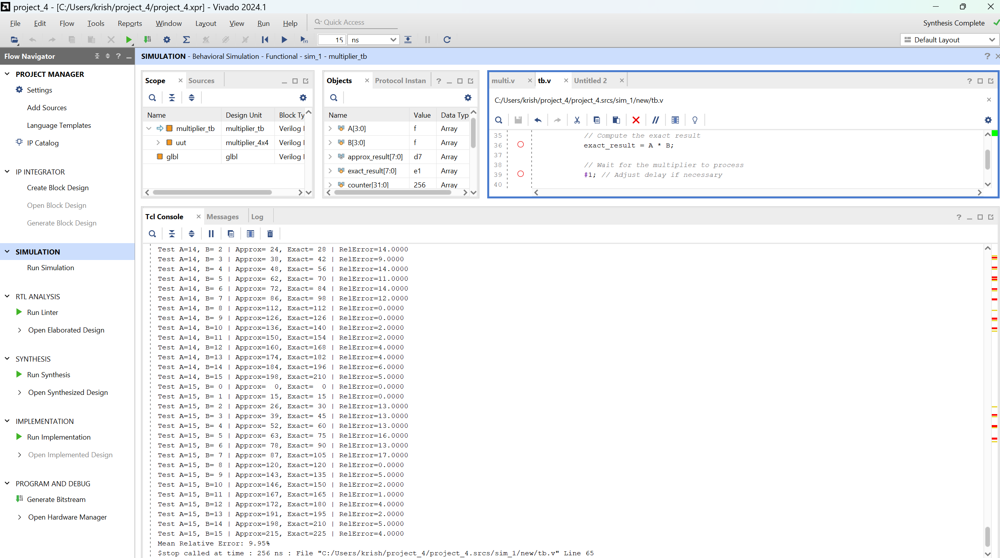
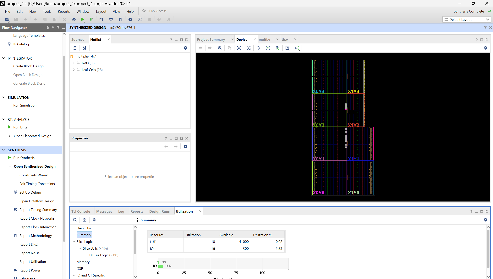
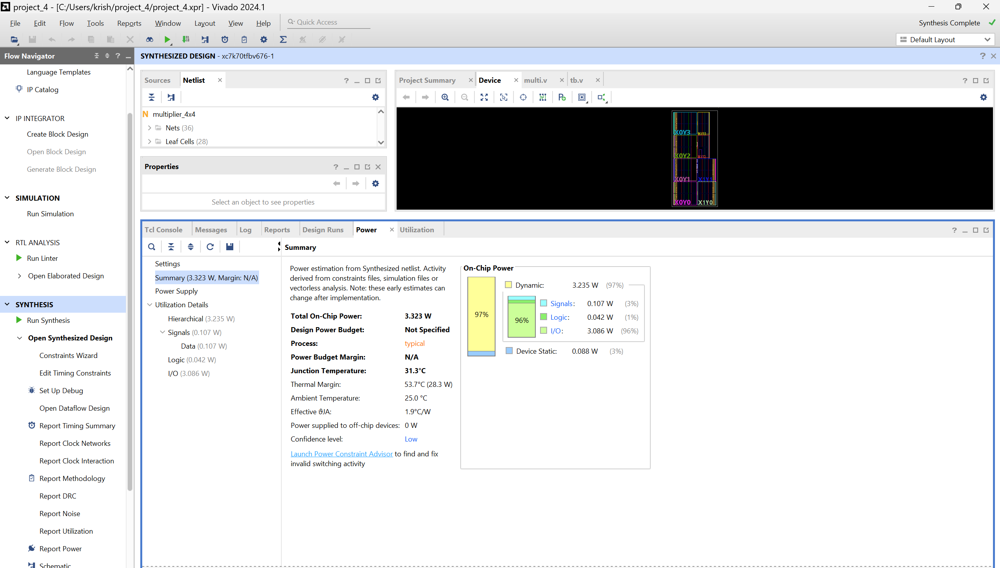

**Name:** Krish Singla

**Enrollment No.:** 23114050

**Degree:** Bachelor of Technology

**Branch:** Computer Science and Engineering

**Institute:** Indian Institute of Technology, Roorkee

**Open Project:** Approximate 4x4 Multiplier (PAaC IITR)

# Approximation of the 4x4 Multiplier (10 LUT, <10% MRE - Mean Relative Error)

This project uses only 10 LUTs to generate an estimated 4x4 multiplier with a mean relative inaccuracy of 9.95%.

### Key Techniques Used

- Approximate Adders and Compressors
- Probability-Aware Design
- Optimization of Lower Bit Positions for Error Tolerance -->

## Design Philosophy

Initially, it was simple to obtain an error of roughly 9% using 12 LUTs by using basic approximation adders and compressors in the LSB positions. But by finding a compromise between inaccuracy and resource usage, I hoped to push the boundaries even further.

By carefully applying probability analysis and selecting the ideal combination of approximate adders and compressors, I was able to decrease the LUT count to 10 while keeping the mean error below 10%, achieving a highly optimised trade-off between accuracy and area.

## Simulation and Verification

Simulation confirms the error behavior across all input combinations:

Vivado utilization and power summaries are as follows:

**Utilization Summary:**

**Power Summary:**

## Files Included

- `multiplier.v`: Verilog implementation of the multiplier
- `multiplier_tb.v`: Testbench for simulation - Provided along with the problem statement

## Results

| Metric               | Value   |
| -------------------- | ------- |
| LUTs Used            | 10      |
| Mean Relative Error  | 9.95%   |
| Max Rel. Error (Obs) | ~14%    |
| IOBs Used            | 16      |
| Power (Total)        | 3.323 W |

---

## Future Work

- Extension Using Hierarchical Approximation to 8x8 or 16x16
- Dynamic control over the trade-off between power and precision
- ML-driven design space exploration for additional logic minimisation

## How to Run

You will need two steps to run the code in VSCode:

1. In terminal, run the following command to compile the code:
   `iverilog -o am_out.vvp multiplier_tb.v multiplier.v`
2. Then run the following command to simulate the code:
   `vvp am_out.vvp`

In Vivado, you can simply run simulation and synthesis using the GUI.

---
